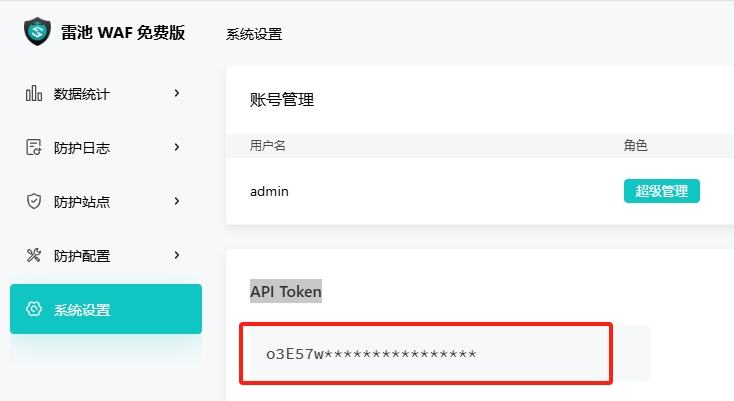

# 长亭WAF社区版

长亭WAF社区版非专业版没有Syslog权限，采用前端轮询的方式获取告警数据。


## 下载模块

```shell
wget https://raw.githubusercontent.com/SecAegis/SecAutoBan/main/device/alarm/chaitin_waf_ce/chaitin_waf_ce.py
```

## 安装依赖

```shell
pip3 install SecAutoBan requests
```

## 获取长亭雷池WAF Token

登录WAF管理界面，在`系统设置`-`API Token`处生成Token并复制




## 运行

```shell
server_ip=127.0.0.1 server_port=80 sk=sk-xxx chaitin_waf_url=https://xxx.xxx.xxx.xxx:9443 chaitin_waf_apikey=xxx python3 chaitin_waf_ce.py
```


## 环境变量说明

| 变量名                | 样例                           | 描述              |
|--------------------|------------------------------|-----------------|
| server_ip          | 127.0.0.1                    | 平台IP            |
| server_port        | 80                           | 平台端口            |
| sk                 | sk-xxx                       | 连接密钥            |
| chaitin_waf_url    | https://xxx.xxx.xxx.xxx:9443 | 长亭WAF URL       |
| chaitin_waf_apikey | xxx                          | 长亭WAF API Token |


