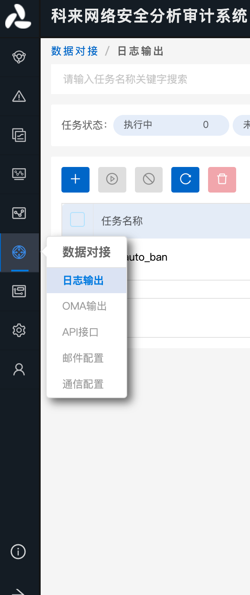
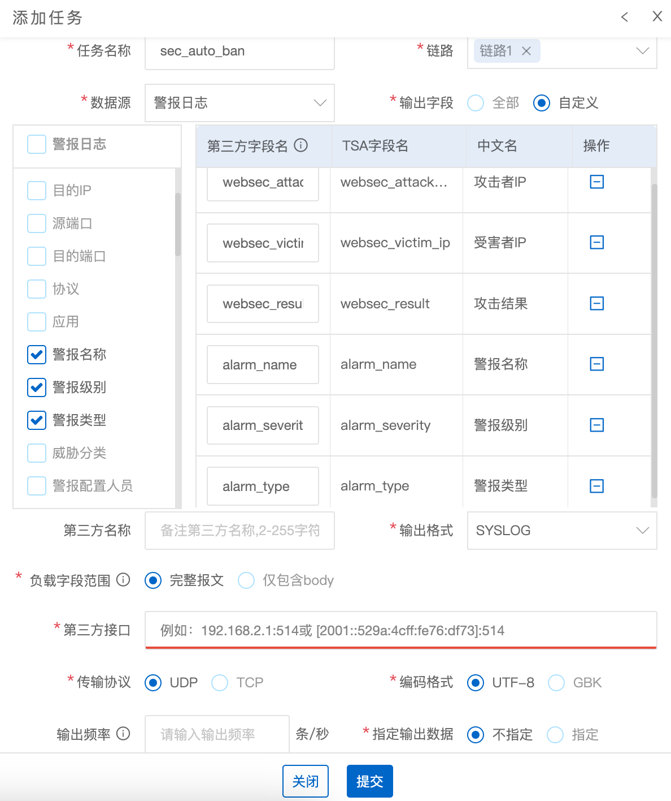
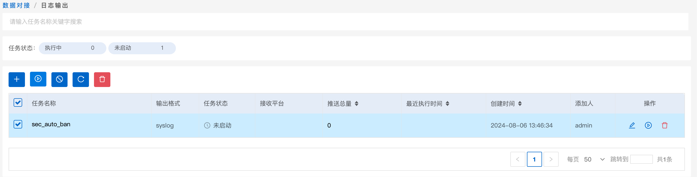

# 科来网络安全分析审计系统

## 下载模块

```
wget https://raw.githubusercontent.com/SecAegis/SecAutoBan/main/device/alarm/kelai_wangluoanquanfenxishenjixitong/kelai_wangluoanquanfenxishenjixitong.py
```

## 安装依赖

```
pip3 install SecAutoBan
```

## 配置说明

### 配置科来网络安全分析审计系统

科来网络安全分析审计系统支持外发syslog，通过`数据对接`-`日志输出`，配置syslog服务。



新增一条配置，配置参数如图所示



配置完成后需点击启用



## 运行

```shell
server_ip=127.0.0.1 server_port=80 sk=sk-xxx listen_port=514 python3 kelai_wangluoanquanfenxishenjixitong.py
```

## 环境变量说明

| 变量名         | 样例        | 描述         |
|-------------|-----------|------------|
| server_ip   | 127.0.0.1 | 平台IP       |
| server_port | 80        | 平台端口       |
| sk          | sk-xxx    | 连接密钥       |
| listen_port | 514       | 监听Syslog端口 |