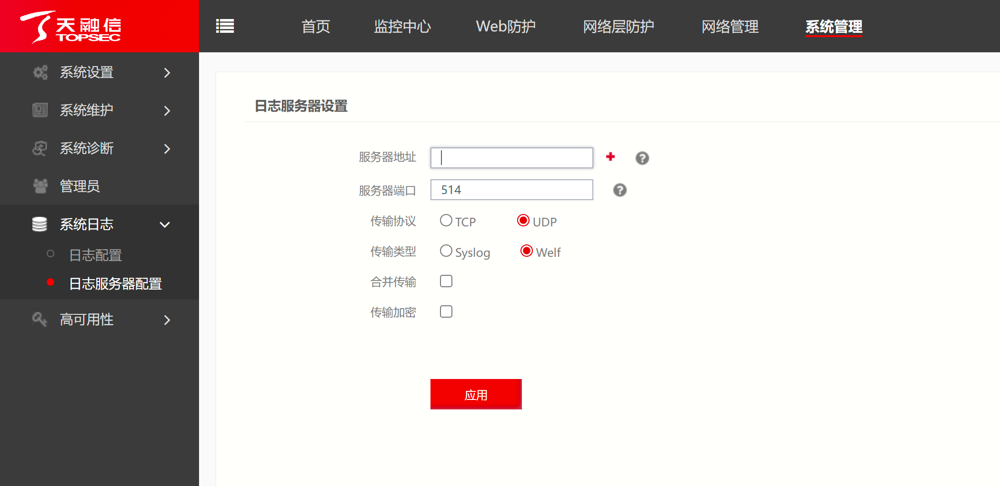

# 天融信WAF

## 下载模块

```
wget https://raw.githubusercontent.com/SecAegis/SecAutoBan/main/device/alarm/topsec_waf/topsec_waf.py
```

## 配置说明

### 配置WAF

登录WAF后台，通过`系统管理`-`系统日志`-`日志服务器配置`，添加服务器。



服务器地址填写本模块运行的主机IP，端口可自定义配置，配置完成点击应用即可。

### 安装依赖

```
pip3 install SecAutoBan
```

### 配置模块

#### 修改回连核心模块配置

更改脚本第`39`-`41`行

```
server_ip = "127.0.0.1",
server_port = 80,
sk = "sk-xxx",
```

#### 配置syslog监听地址

更改脚本第`37`行，请与SYSLOG中配置的端口一致

```
listen_syslog_udp_port = 514
```

## 运行

```shell
python3 topsec_waf.py
```

