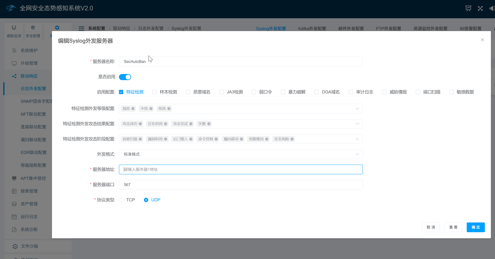

# 启明星辰全网安全态势感知系统

## 下载模块

```
wget https://raw.githubusercontent.com/SecAegis/SecAutoBan/main/device/alarm/venustech_qwaqtsgzxt/venustech_qwaqtsgzxt.py
```

## 配置说明

### 配置全网安全态势感知系统

通过`联动响应`-`日志外发配置`，添加syslog推送。



新增一条配置，服务器IP为本脚本运行的服务器IP，传输方式选择UDP，配置选择特征检测即可。

### 安装依赖

```
pip3 install SecAutoBan
```

### 配置模块

#### 修改回连核心模块配置

更改脚本第`34`-`36`行

```
server_ip = "127.0.0.1",
server_port = 80,
sk = "sk-xxx",
```

#### 配置syslog监听地址

更改脚本第`32`行，请与天眼SYSLOG中配置的端口一致

```
listen_syslog_udp_port = 567
```

## 运行

```shell
python3 venustech_qwaqtsgzxt.py
```