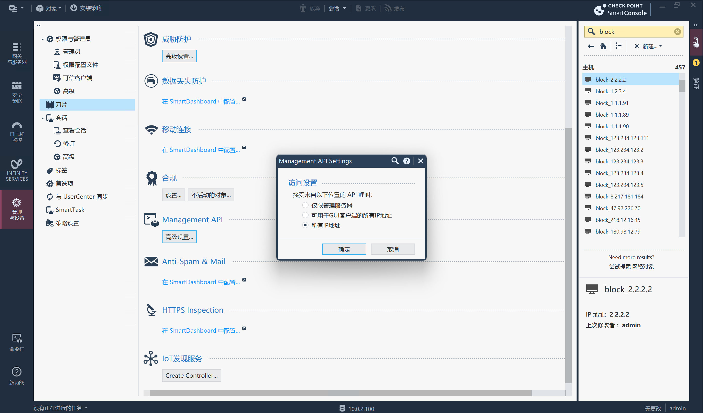
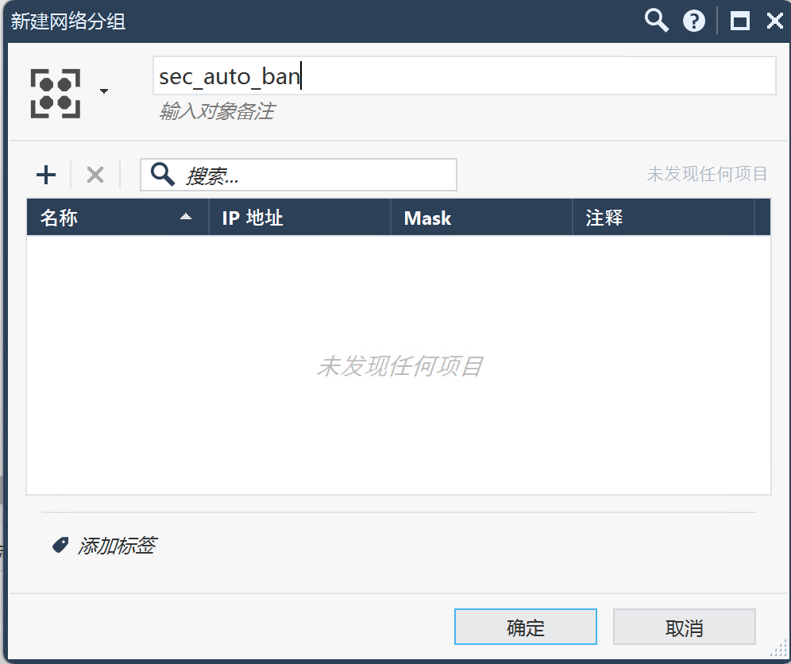
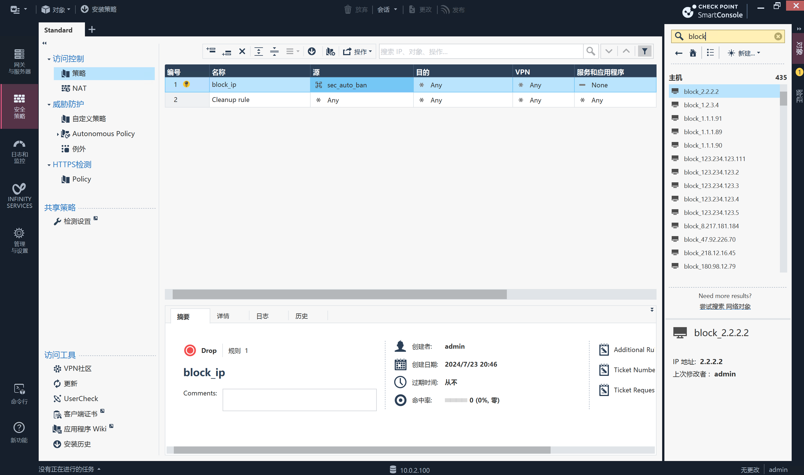

# CheckPoint

CheckPoint封禁模块

## 下载模块

```
wget https://raw.githubusercontent.com/SecAegis/SecAutoBan/main/device/block/check_point/check_point.py
```

## 安装依赖

```
pip3 install SecAutoBan requests
```

## 配置CheckPoint

### 开启Management API



### 新建网络分组

`新建-网络分组`弹出框新建分组`sec_auto_ban`并保存:



### 为网络分组创建封禁规则

在`安全策略-访问控制-策略`页面新建两条规则，分别为阻止源为`sec_auto_ban`及目的为`sec_auto_ban`，图例:



## 运行

```shell
server_ip=127.0.0.1 server_port=80 sk=sk-xxx check_point_url=http://xxx.xxx.xxx.xxx check_point_username=admin check_point_password=xxx check_point_group=sec_auto_ban python3 check_point.py
```

## 环境变量说明

| 变量名                  | 样例                     | 描述                |
|----------------------|------------------------|-------------------|
| server_ip            | 127.0.0.1              | 平台IP              |
| server_port          | 80                     | 平台端口              |
| sk                   | sk-xxx                 | 连接密钥              |
| check_point_url      | http://xxx.xxx.xxx.xxx | 连接 check point 网址 |
| check_point_username | admin                  | check point 用户名   |
| check_point_password | xxx                    | check point 密码    |
| check_point_group    | sec_auto_ban           | check point 分组    |