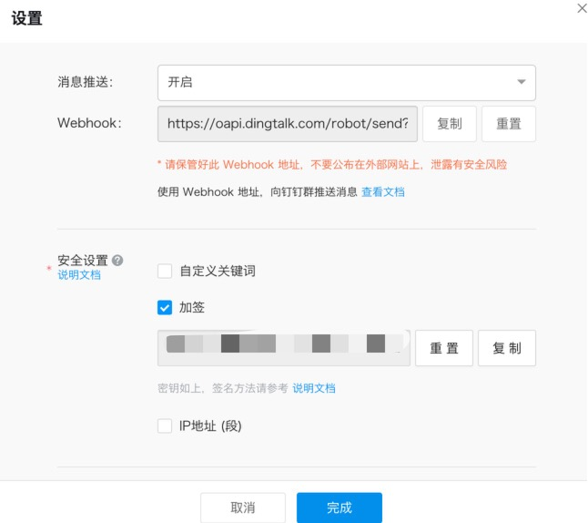

# 钉钉告警通知

本模块不会对IP进行封禁，仅作为向钉钉机器人推送通知

## 下载模块

```
wget https://raw.githubusercontent.com/SecAegis/SecAutoBan/main/device/block/dingtalk_robot/dingtalk_robot.py
```

## 安装依赖

```
pip3 install SecAutoBan requests
```

## 修改钉钉机器人配置

创建机器人后，安全设置选择加签



## 运行

```shell
server_ip=127.0.0.1 server_port=80 sk=sk-xxx webhook="https://oapi.dingtalk.com/robot/send?access_token=xxx" secret=xxx python3 dingtalk_robot.py
```

## 环境变量说明

| 变量名         | 样例                                                    | 描述        |
|-------------|-------------------------------------------------------|-----------|
| server_ip   | 127.0.0.1                                             | 平台IP      |
| server_port | 80                                                    | 平台端口      |
| sk          | sk-xxx                                                | 连接密钥      |
| webhook     | https://oapi.dingtalk.com/robot/send?access_token=xxx | Webhook地址 |
| secret      | xxx                                                   | 加签的值      |
