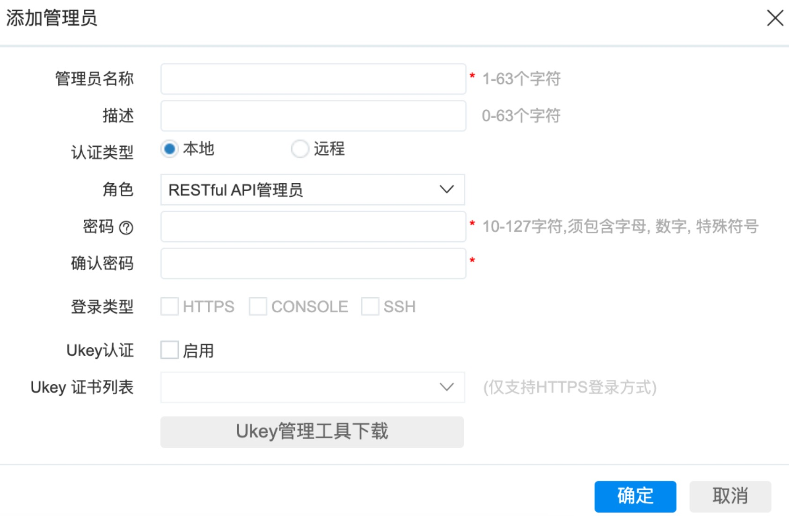

# 奇安信防火墙

奇安信防火墙封禁模块

> 其他被剪裁的类奇安信防火墙设备也可适配，例如SSL编排器等。使用API的功能点在`策略配置`-`黑白名单`-`批量黑IP封堵`，请自行测试。

## 下载模块

```shell
wget https://raw.githubusercontent.com/SecAegis/SecAutoBan/main/device/block/qianxin_firewall/qianxin_firewall.py
```

## 安装依赖

```shell
pip3 install SecAutoBan requests
```

## 配置奇安信防火墙

### 开启RESTful API

登录管理后台，通过`系统配置`-`设备管理`-`本机设置`-`RESTful API`启用。

### 添加RESTful API用户

通过`系统配置`-`设备管理`-`管理账号`添加账号，角色选择`RESTful API管理员`



## 运行

```shell
server_ip=127.0.0.1 server_port=80 sk=sk-xxx fw_url=https://xxx.xxx.xxx.xxx:8443 fw_username=api-admin fw_password=xxx python3 qianxin_firewall.py
```

## 环境变量说明

| 变量名         | 样例                           | 描述        |
|-------------|------------------------------|-----------|
| server_ip   | 127.0.0.1                    | 平台IP      |
| server_port | 80                           | 平台端口      |
| sk          | sk-xxx                       | 连接密钥      |
| fw_url      | https://xxx.xxx.xxx.xxx:8443 | 连接防火墙 URL |
| fw_username | api-admin                    | 防火墙用户名    |
| fw_password | xxx                          | 防火墙密码     |
