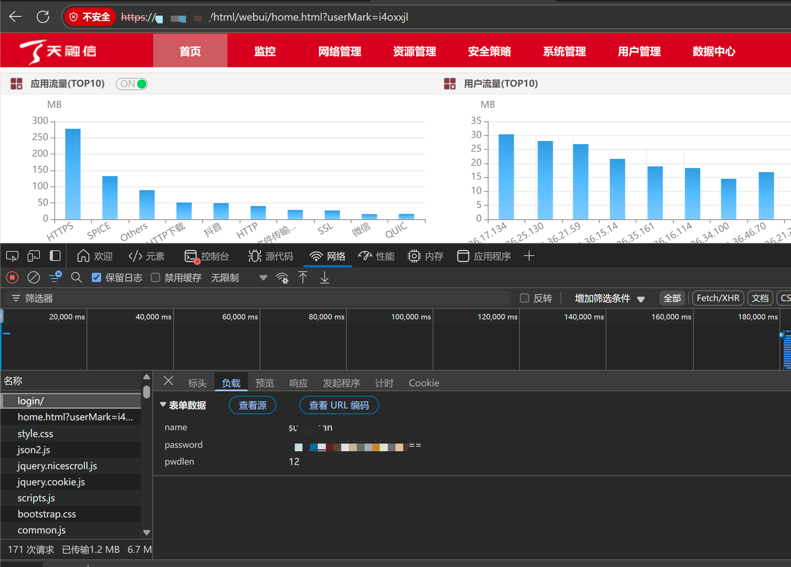

# 天融信防火墙

天融信防火墙封禁模块

## 下载模块

```
wget https://raw.githubusercontent.com/SecAegis/SecAutoBan/main/device/block/topsec_firewall/topsec_firewall.py
```

## 安装依赖

```
pip3 install SecAutoBan requests
```

## 配置天融信防火墙

1. 关闭验证码登录
2. 抓取天融信防火墙用户名密码（F12即可）




## 运行

```shell
server_ip=127.0.0.1 server_port=80 sk=sk-xxx fw_url=http://xxx.xxx.xxx.xxx fw_username=api-admin fw_password=xxx fw_password_len=6 python3 topsec_firewall.py
```

## 环境变量说明

| 变量名             | 样例                     | 描述        |
|-----------------|------------------------|-----------|
| server_ip       | 127.0.0.1              | 平台IP      |
| server_port     | 80                     | 平台端口      |
| sk              | sk-xxx                 | 连接密钥      |
| fw_url          | http://xxx.xxx.xxx.xxx | 连接防火墙 URL |
| fw_username     | api-admin              | 防火墙用户名    |
| fw_password     | xxx                    | 防火墙密码     |
| fw_password_len | 6                      | 防火墙密码长度   |