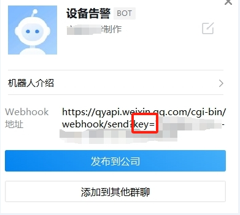

# 企业微信告警通知

本模块不会对IP进行封禁，仅作为向企业微信机器人推送通知

## 下载模块

```shell
wget https://raw.githubusercontent.com/SecAegis/SecAutoBan/main/device/block/workweixin_robot/workweixin_robot.py
```

## 安装依赖

```shell
pip3 install SecAutoBan
```


#### 修改企业微信机器人配置

创建机器人后，记录机器人的key(key=后面的值)



## 运行

```shell
server_ip=127.0.0.1 server_port=80 sk=sk-xxx webhook="https://qyapi.weixin.qq.com/cgi-bin/webhook/send?key=" hook_key=aaaaaaaa-aaaa-aaaa-aaaa-aaaaaaaaaaaa python3 workweixin_robot.py
```

## 环境变量说明

| 变量名         | 样例                                                    | 描述        |
|-------------|-------------------------------------------------------|-----------|
| server_ip   | 127.0.0.1                                             | 平台IP      |
| server_port | 80                                                    | 平台端口      |
| sk          | sk-xxx                                                | 连接密钥      |
| webhook     | https://qyapi.weixin.qq.com/cgi-bin/webhook/send?key= | Webhook地址 |
| hook_key    | aaaaaaaa-aaaa-aaaa-aaaa-aaaaaaaaaaaa                  | hook key  |
